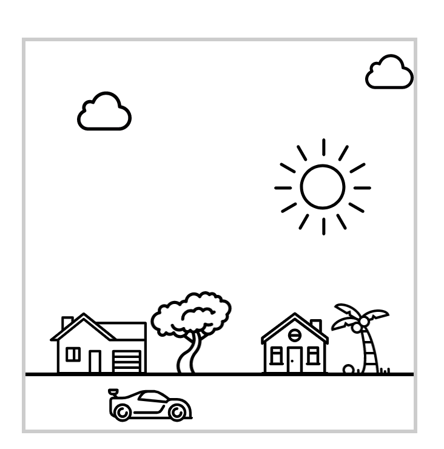

# CSS exercise 06-b: Extra exercise

Try adjusting just CSS background properties in `town-backgrounds.css` without adjusting anything else.

Link up the images, and then try position them in the correct places.

You'll notice the boxes they're in are too big for the natural sizes of the images:

ID | Width | Height
--- | --- | ---
`#cloud-1` | `50px` | `40px`
`#cloud-1` | `50px` | `45px`
`#house-1` | `80px` | `80px`
`#house-2` | `56px` | `56px`
`#car` | `70px` | `70px`

So, position them correctly within the box too, until it looks something like this:

