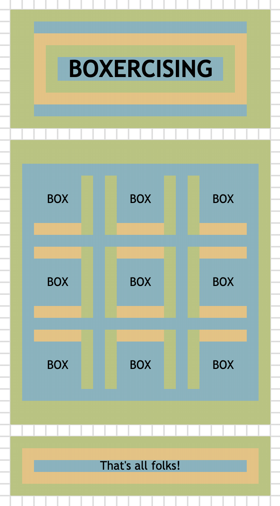

# CSS Exercise 10: Box model exercising

Here's another puzzle for you!

I want you to make `boxes.html` look like the following:

## Take note

- Use your browser, and not the preview pane in VSCode
- Each white block (with a 1-pixel grey broder) represents `1rem`
- The light-blue colour represents the element's `content-box`, or the element's natural `width` and `height`
- The light-green colour represents the element's `padding`
- The orange colour represents the element's `border`

## Rules

Here's the tricky bit, you can only use whole `rem`s as units (No decimals!) and you can only use the following properties:

- `border` (and longhand properties)
- `padding` (and longhand properties)
- `margin` (and longhand properties)
- `display`
