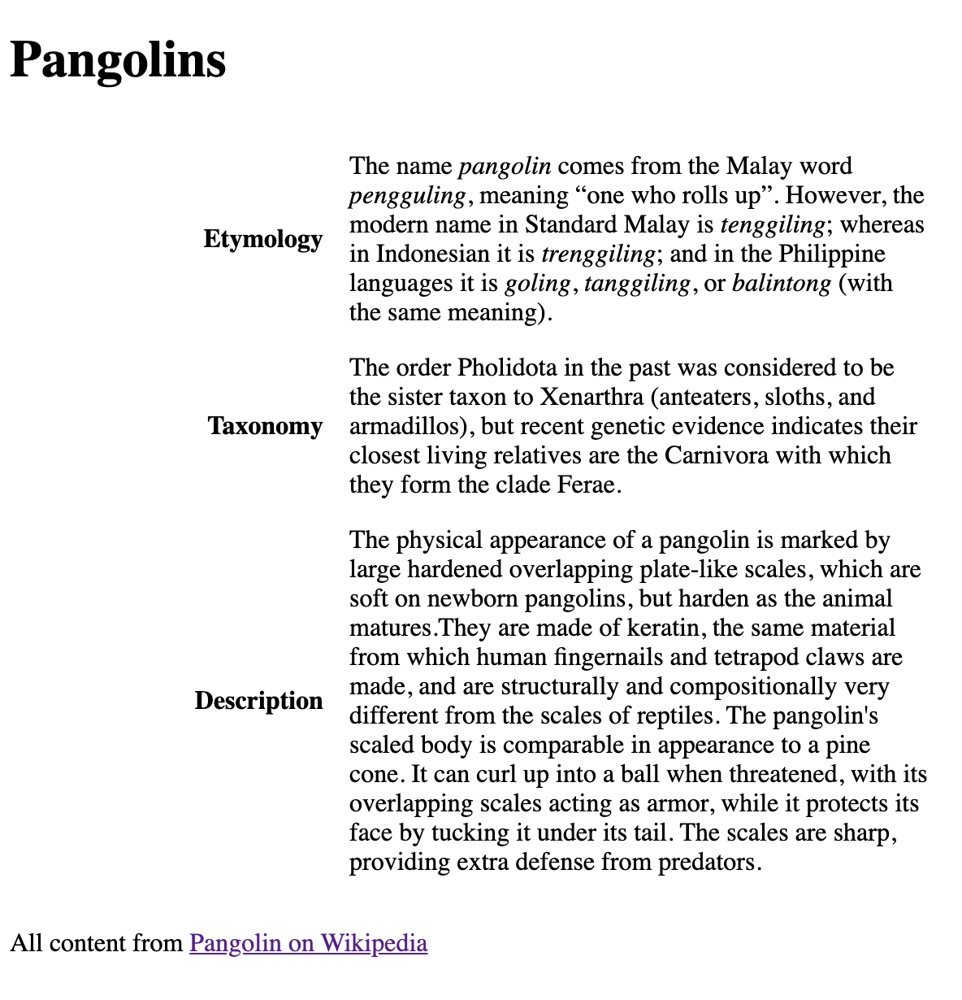

# CSS exercise 16: Styling tables

For this exercise, let's try create a table-like layout from ordinary non-table HTML elements.

If the user's device supports a screen width wider than `600px`, then switch to this layout:

Using this image as an example, try and achieve the same thing using CSS without touching the markup in `tables.html`, making sure that if the user's device is thinner than `600px` that the layout returns to the normal top-down flow.

**Take note:** the 'cells' in the first column take up a third of the width.
