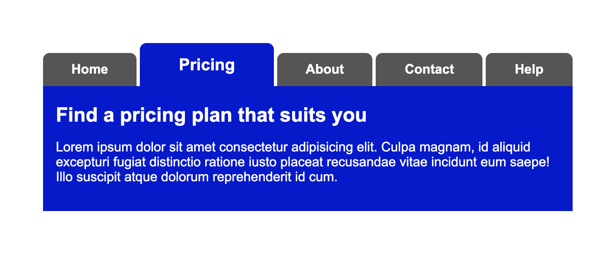

# CSS Exercise 43: CSS Methodologies

There are many methodologies to writing CSS. They're guidelines for how you should use and write your CSS, depending on your development environment / situation.

Let's do an exercise with a popular methodology: BEM.

## Navigation

Create this navigation example using BEM.

All the units you need are specified in `css/nav.css`
